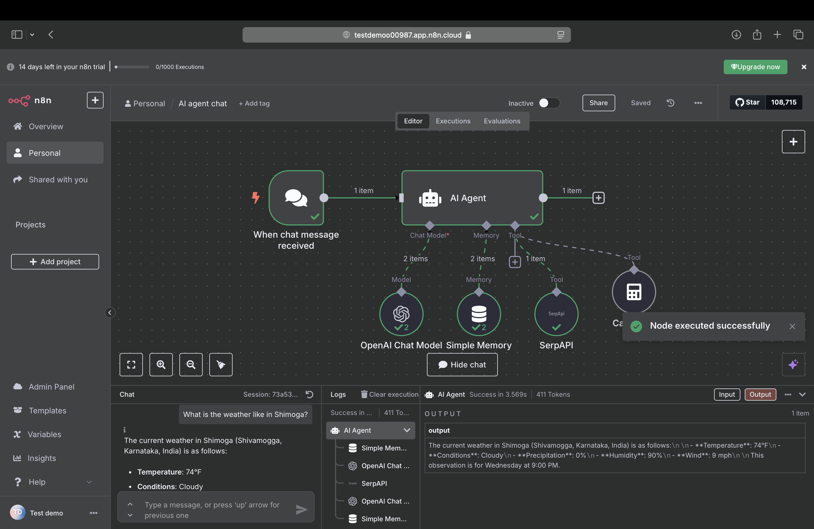

# 🧠 AI Chat Agent using n8n, OpenAI & SerpAPI

This project showcases my first AI-powered chatbot built with [n8n](https://n8n.io), OpenAI, and SerpAPI.

## 📌 Features
- Natural Language Understanding via OpenAI (GPT)
- Web search support using SerpAPI
- Arithmetic operations using built-in Calculator node
- Persistent conversation using Simple Memory node

## 🧩 Workflow Overview

1. **Chat Trigger** – Starts the flow on new user input  
2. **AI Agent** – Uses OpenAI Chat Model  
3. **Tools** – Includes:
   - **SerpAPI** for Google search
   - **Calculator** for math operations  
4. **Simple Memory** – Maintains chat context

## 🖼️ Workflow Screenshots

 (assets/workflow-screenshot-2.png)

## 🚀 How to Run
1. Import the JSON file in your local or hosted n8n instance
2. Set up the following secrets:
   - `OPENAI_API_KEY`
   - `SERPAPI_API_KEY`

## 📢 Built by Aditya S. Jadhav
